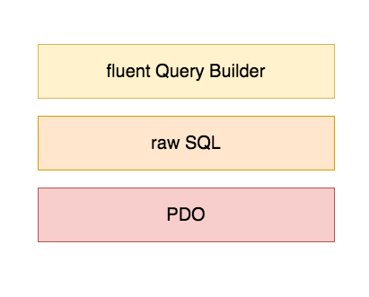

# Raw SQL vs Fluent Query Builder

> Cuando trabajamos con un server de bases de datos, Laravel nos simplifica el trabajo con el patrón Façade.
> Nos provee una clase DB que simplifica todo el trabajo con el server.

> Ya no necesitamos crear una clase de conexión

        class Conexion
    {
        private static $link;

        private function __construct()
        {} // impedimos instanciar la clase

        static function conectar()
        {
            // si no hay una conexion
            if( !isset( self::$link ) ){
                //creamos la conexion
                self::$link = new PDO(
                    'mysql:host=localhost;dbname=agencia',
                    'root',
                    'root'
                );
            }

            return self::$link;
        }

    }

> Ni tampoco una clase para el CRUD

    class Region
    {
        private $regID;
        private $regNombre;

        public function listarRegiones()
        {
            $link = Conexion::conectar();
            $sql = "SELECT regID, regNombre
                        FROM regiones";

            $stmt = $link->prepare($sql);
            $stmt->execute();

            $regiones = $stmt->fetchAll(PDO::FETCH_ASSOC);
            return $regiones;
        }

        public function verRegionPorID()
        {
            $idRegion = $_POST['idRegion'];
            $link = Conexion::conectar();
            $sql = "SELECT regID, regNombre
                        FROM regiones 
                        WHERE idRegion = :idRegion";

            $stmt = $link->prepare($sql);
            $stmt->bindParam( 'idRegion', $idRegion, PDO::PARAM_STR )
            $stmt->execute();

            $region = $stmt->fetch(PDO::FETCH_ASSOC);
            return $region;
        }

    }

> La clase DB se encarga de parte de la magia

## Raw SQL

	DB::select('SELECT ...');
	DB::insert('INSERT INTO.....');
	DB::update('UPDATE ....');
	DB::delete('DELETE FROM...');

## Fluent Query Builder

    DB::table('tableName')->get();  
    DB::table('tableName')  
            ->select('col1', 'col2', 'col3')  
            ->get();  
    DB::table('tableName')  
            ->where('colID', $var)  
            ->first();  

    DB::table('tableName')  
            ->insert([]);  
    DB::table('tableName')  
            ->where('colID', $var)
            ->update([]);  
    DB::table('tableName')
            ->where('colID', $var)  
            ->delete();  