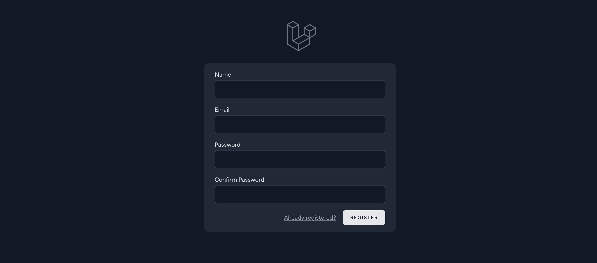

# Laravel Breeze

> Laravel Breeze es un kit de inicio **minimalista** para una implementación de aplicaciones de:

- [ ] Registro de usuarios  
- [ ] Login de usuarios  
- [ ] Autenticación de usuarios  
- [ ] Reseteo de contraseña  

> También incluye una página simple de **perfil de usuario** en la que se puede modificar el nombre, email y contraseña

> Las vistas predeterminadas de Laravel Breeze estan compuestas por plantillas de Blade estilizadas con TailwindCSS 

> **Nota:** se recomiendo utilizar Laravel Breeze en proyectos nuevos.

## Instalación: 

> Primero, debemos crear un nuevo proyecto Laravel, configurar la base de datos, y correr las migraciones. 
> Una vez cubiertos estos pasos, podemos instalar Laravel Breeze utilizando Composer:

- [ ] Crear proyecto nuevo

        composer create-project laravel/laravel breeze 

- [ ] Modernos al directorio del proyecto nuevo

      cd breeze 

> Opcional: creamos la base de datos 
> Si no creamos en este momento la base de datos, luego de configurar el archivo .env
> cuando querramos correr el proyecto (o las migraciones) nos preguntará si queremos crear las base de datos 
> y laravel la creará por nosotros
>    WARN  The database 'nombreBase' does not exist on the 'mysql' connection.
>  ┌ Would you like to create it? ─┐  
   │ Yes                           │  
   └─────────────────────────────┘  

- [ ] Configuramos el archivo .env
  
- [ ] Corremos las migraciones    

      php artisan migrate

- [ ] Descargamos Breeze usando composer

        composer require laravel/breeze --dev  

> Luego que composer termina de descargar el package de Laravel Breeze, debemos terminar su instalación.

- [ ]  Instalamos breeze

       php artisan breeze:install    

> Este comando genera las vistas de autenticación, las routes, los controllers, y otros recursos de la aplicación.
> El comando breeze:install te solicitará que selecciones tu stack preferido de frontend y framework de testing:

┌ Which Breeze stack would you like to install? ──┐  
│ › ● Blade                                       │  
│   ○ React with Inertia                          │  
│   ○ Vue with Inertia                            │  
│   ○ API only                                    │  
└──────────────────────────────────────────────┘  
┌ Would you like dark mode support? ─────────────┐  
│ ● Yes / ○ No                                    │  
└──────────────────────────────────────────────┘  
┌ Which testing framework do you prefer? ────────┐  
│   ○ PHPUnit                                     │  
│ › ● Pest                                        │  
└──────────────────────────────────────────────┘  

> Tnstalación finalizada. 
> INFO  Breeze scaffolding installed successfully.

## Correr Laravel Vite. 

> Como Laravel Breeze instala además Laravel Vite: (*ver)  
>> build  
>> vite build  

>> vite v4.4.9 building for production...  

> Cuando corramos el proyecto, para que veamos las actualizaciones en tiempo real también debemos correr Laravel Vite.

       php artisan serve  

       npm install 
       npm run dev 

> Enjoy coding! 

